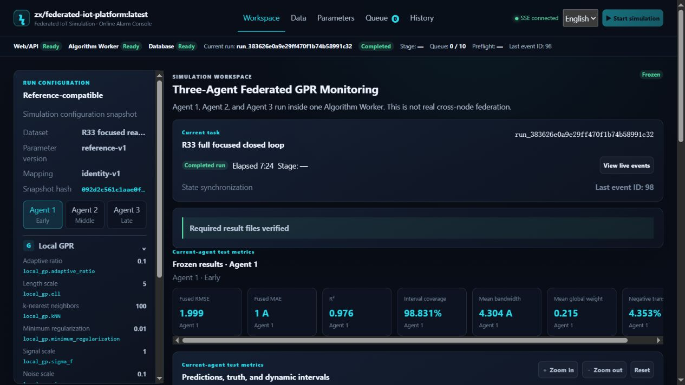
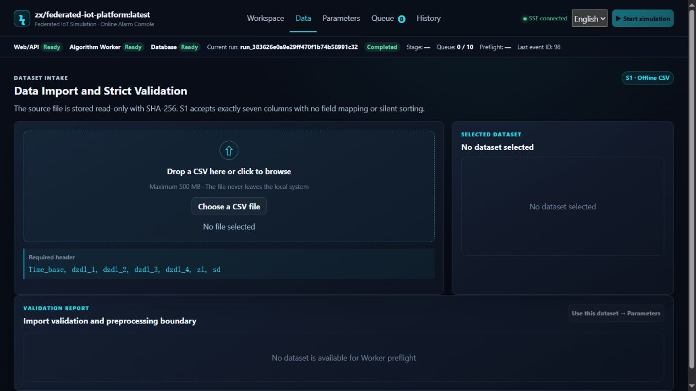
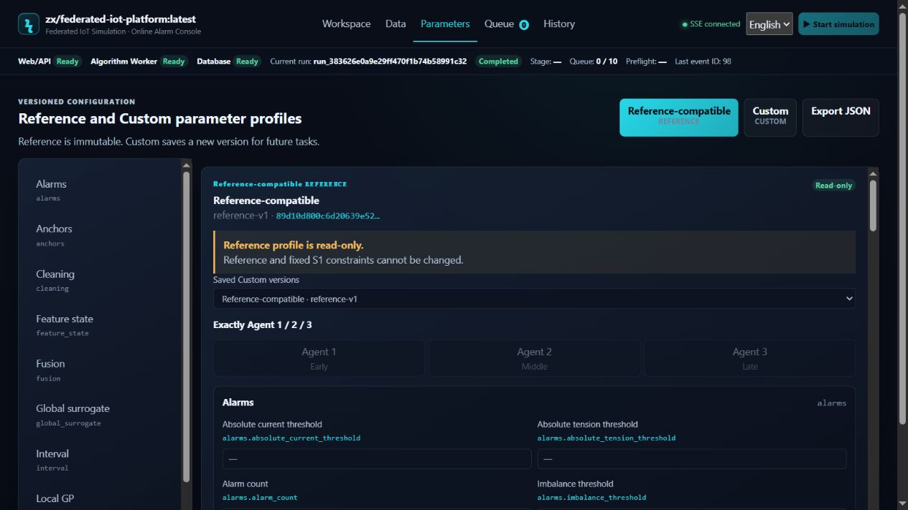
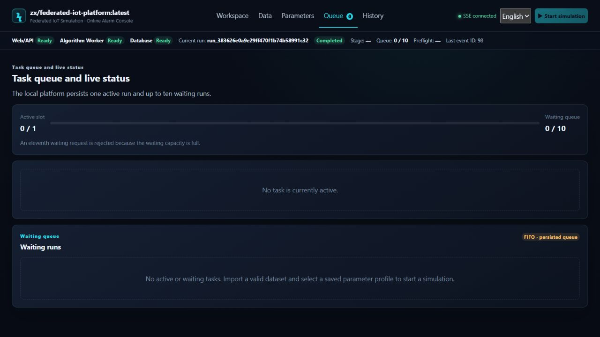
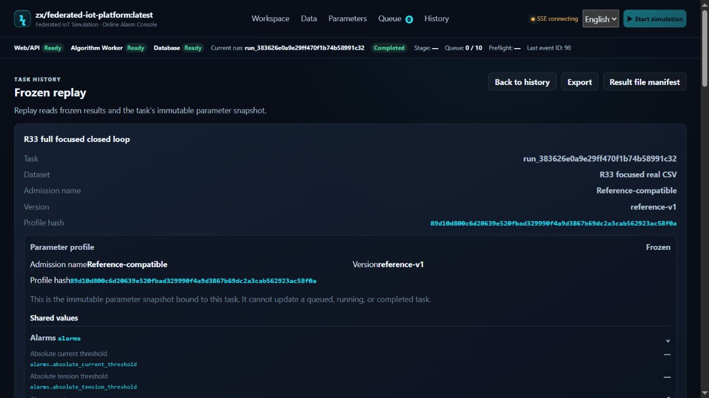

# ZX Federated IoT Platform

ZX Federated IoT Platform is a local, Docker-based simulation system for power-load prediction and alarm analysis. The M1 release provides one complete PostgreSQL-backed workflow from CSV intake to preprocessing, parameter snapshots, queued simulation, three-Agent execution, diagnostics, history, replay, and export.



## M1 features

- Strict seven-column CSV intake with SHA-256 retention and Worker preflight.
- Reference and Custom parameter profiles with 69 declared paths, 67 editable values, per-Agent overrides, immutable saved versions, rename, and restore-default draft actions.
- One active simulation and up to ten waiting simulations, with durable cancellation and SSE status projection.
- One generic Algorithm Worker executing Agent 1, Agent 2, and Agent 3 through shared preprocessing, reusable execution, and explicit aggregation interfaces.
- Prediction intervals, fused metrics, point-synchronized diagnostics, alarms, traceability, and twelve verified result files.
- Immutable history, deep-linked replay, filtered alarm access, CSV/JSON result access, and replay export.
- English on every new page load, optional Simplified Chinese for the current page, keyboard operation, and responsive layouts from 1024px through 4K.
- Local Docker deployment with PostgreSQL, a Web/API container, and one Algorithm Worker container.

## Product pages

| Page | Primary purpose |
| --- | --- |
| Workspace | Inspect a selected run, frozen configuration, three-Agent results, charts, diagnostics, alarms, result integrity, and SSE events. |
| Data | Upload a local CSV, follow authoritative preflight state, and inspect validation and preprocessing statistics. |
| Parameters | Review the immutable Reference profile or create versioned Custom profiles and Agent overrides. |
| Queue | Monitor the active slot and waiting queue, inspect progress, and cancel eligible tasks. |
| History and Replay | Search terminal runs, inspect frozen snapshots, replay result points, and export verified output. |

<p>
  
  
</p>
<p>
  
  
</p>

## Architecture

```text
Browser
  │ REST + SSE
  ▼
Web/API ─────────────── PostgreSQL
  │                         ▲
  │ dataset and result      │ leases, events, terminal state
  │ namespaces              │
  ▼                         │
Algorithm Worker ───────────┘
  └─ Agent 1 / Agent 2 / Agent 3 in one task-local execution process
```

The Web/API service owns admission, persistence, immutable snapshots, cancellation, SSE, history, and verified result access. PostgreSQL is the only M1 database. The Worker uses a narrow repository-function boundary and does not receive direct application-table access. It validates each frozen task envelope, reads the retained dataset, executes the numerical pipeline, and publishes result files through an atomic commit boundary.

## Repository layout

| Path | Contents |
| --- | --- |
| `backend/` | Go Web/API service, PostgreSQL migrations, persistence, queueing, SSE, and verified result access. |
| `frontend/` | TypeScript SPA, localization, responsive layouts, accessibility, charts, and page interactions. |
| `algorithm-worker/` | Python preprocessing and simulation runtime with the generic three-Agent execution model. |
| `contracts/api/` | Public OpenAPI, JSON Schemas, and deterministic API fixtures. |
| `contracts/worker/` | Public Worker envelope, lifecycle, result-manifest schemas, and deterministic fixtures. |
| `deploy/` | Dockerfiles, Compose, safe configuration templates, deployment scripts, and operator documentation. |

## Build and test

The public source tree supports module-based development builds. Frozen Docker
release builds remain offline after their reviewed local dependency inputs are
restored in an approved staging environment.

Backend:

```powershell
Set-Location backend
$env:GOTOOLCHAIN = 'local'
go mod download
go mod verify
go test -count=1 -mod=readonly ./...
go build -mod=readonly ./cmd/web-api
```

The public repository intentionally omits `backend/vendor/`. These commands
require access to the configured trusted `GOPROXY` or a pre-populated module
cache. The offline release path separately restores and verifies the frozen
vendor tree before using `-mod=vendor`.

Frontend:

```powershell
Set-Location frontend
npm ci --offline --ignore-scripts --cache ./.npm-cache
npm run verify
```

Algorithm Worker:

```powershell
Set-Location algorithm-worker
python -m unittest discover -s tests -v
```

Module-specific requirements and verification commands are documented in each module README.

## Docker deployment

The runtime topology contains PostgreSQL, a one-shot migration gate, Web/API, and one Algorithm Worker. Web/API listens on `0.0.0.0:8080` inside the container and publishes one operator-selected host port. PostgreSQL and Worker ports remain internal.

A clean public Git clone can build local connected-source images without
`backend/vendor/`, `frontend/.npm-cache`, or Python wheel binaries. Follow the
[connected source build and local run guide](deploy/runbooks/connected-source-build.md).
Those images use source-bound `1.0.0-m1-connected-<source-sha>` tags and are
not official release identities.

Start with [deploy/README.md](deploy/README.md). Detailed local image build, offline package, installation, health, backup, restore, and later human-operated distribution procedures are in [the code-cut deployment manual](deploy/runbooks/code-cut-deployment-manual.md).

No script in this repository publishes source, images, or packages. Registry and archive publication are manual operations performed outside the release build after separate approval.

## M1 limits and later work

M1 fixes the Worker pool capacity at one and each simulation contains exactly three logical Agents. PostgreSQL is the only implemented database. Deployment targets a single Docker Engine host on a controlled network. SQLite support, variable Agent cardinality, multi-Worker task sharding, public Internet ingress, authentication, multi-host orchestration, and additional platform profiles require separate requirements, architecture, and verification work.

## License

MIT
